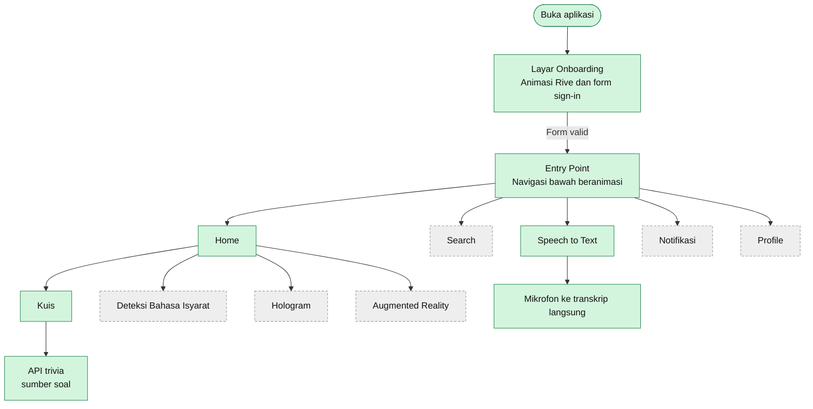
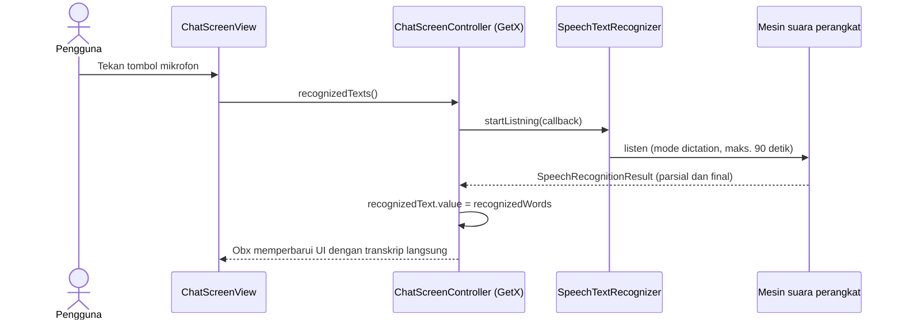
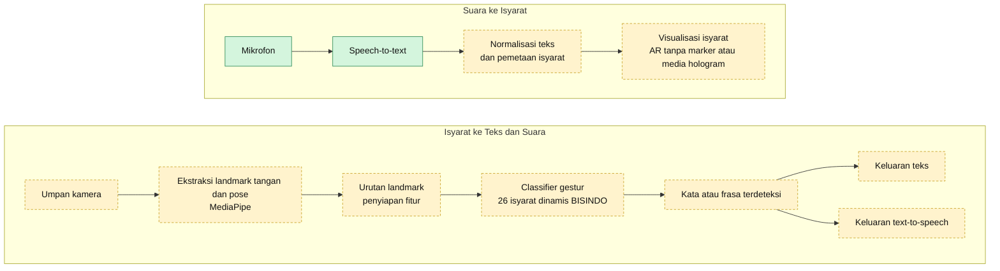

<div align="center">

# DEAFSAPP

**Aplikasi pendamping belajar Bahasa Isyarat Indonesia (BISINDO) berbasis Flutter yang aksesibel**


[English](README.md) | Bahasa Indonesia

</div>

---

## Daftar Isi

1. [Gambaran Umum](#gambaran-umum)
2. [Latar Belakang dan Dampak](#latar-belakang-dan-dampak)
3. [Cakupan Repositori Ini](#cakupan-repositori-ini)
4. [Fitur](#fitur)
5. [Arsitektur](#arsitektur)
6. [Teknologi](#teknologi)
7. [Struktur Proyek](#struktur-proyek)
8. [Memulai](#memulai)
9. [Rencana Pengembangan](#rencana-pengembangan)
10. [Keterbatasan Saat Ini](#keterbatasan-saat-ini)
11. [Ucapan Terima Kasih](#ucapan-terima-kasih)
12. [Penulis](#penulis)

---

## Gambaran Umum

DEAFSAPP adalah aplikasi mobile yang dirancang untuk mengurangi hambatan komunikasi antara komunitas Tuli dan komunitas dengar di Indonesia. Aplikasi ini menargetkan **BISINDO** (Bahasa Isyarat Indonesia), bahasa isyarat yang paling banyak digunakan komunitas Tuli di Indonesia, dengan tiga gagasan utama:

- **Belajar**: materi interaktif dan kuis untuk siswa dan guru.
- **Pengenalan**: menerjemahkan gerakan isyarat menjadi teks dan suara.
- **Visualisasi**: menampilkan isyarat melalui Augmented Reality (AR) dan media bergaya hologram.

Repositori ini (**DEAFSAPP-V1**) berisi versi pertama aplikasi: kerangka aplikasi Flutter, navigasi, onboarding, modul speech-to-text, dan modul kuis.

---

## Latar Belakang dan Dampak

DEAFSAPP berawal dari proyek skripsi Sistem Informasi di **Universitas Muhammadiyah Sumatera Utara (UMSU)** dan dikembangkan bersama **SLB Melati Aisyah** (sekolah luar biasa di Medan) sebagai program pengabdian masyarakat.

Hasil yang dilaporkan untuk sistem pada tahap skripsi:

| Metrik | Hasil |
|---|---|
| Urutan isyarat dinamis BISINDO yang dikenali | **26** |
| Akurasi pengenalan gestur | **76,1%** |
| Skor usability positif | **76,5%** |
| Peserta uji lapangan | **17 siswa dan 8 guru** |
| Penghargaan | Finalis Nasional Lomba Inovasi Digital Mahasiswa (LIDM) 2023 |
| Penghargaan | Program riset skripsi berbiaya penuh di Universitas Pendidikan Indonesia (UPI), Bandung |
| Kekayaan intelektual | Hak Cipta terdaftar, No. EC00202341333, DJKI, 2023 |

> Hasil di atas menggambarkan sistem tahap skripsi secara keseluruhan. Model machine learning dan pipeline AR lengkapnya **tidak termasuk dalam snapshot repositori ini**. Lihat [Cakupan Repositori Ini](#cakupan-repositori-ini).

---

## Cakupan Repositori Ini

Agar ekspektasi jelas, berikut isi repositori ini.

| Area | Status di repositori ini |
|---|---|
| Kerangka aplikasi, routing, dependency injection (GetX) | Sudah ada |
| Onboarding dan form sign-in beranimasi (Rive) | Sudah ada (hanya UI, tanpa autentikasi backend) |
| Navigasi bawah beranimasi (Rive) | Sudah ada |
| Layar Speech-to-Text (transkrip langsung dari mikrofon) | Sudah ada |
| Modul kuis (timer, skor, umpan balik jawaban) | Sudah ada (memakai API trivia publik sebagai konten sementara) |
| Layar deteksi bahasa isyarat | Placeholder |
| Layar Augmented Reality | Placeholder |
| Layar Hologram | Placeholder |
| Layar Search dan Profile | Belum diimplementasikan |
| Model pengenalan gestur (landmark MediaPipe dan classifier) | Tidak disertakan |

---

## Fitur

**Tersedia sekarang**

- Alur onboarding dengan form sign-in beranimasi, loading, sukses, dan konfeti.
- Layar Home dengan kartu menu (Kuis, Deteksi Bahasa Isyarat, Hologram, Augmented Reality).
- Navigasi bawah melayang beranimasi dengan lima tab.
- Speech-to-Text: tekan mikrofon dan ucapan langsung ditranskripsi di layar, berguna sebagai alat bantu komunikasi dari orang dengar ke orang Tuli.
- Kuis: timer 60 detik per soal, pilihan jawaban diacak, umpan balik hijau dan merah, serta penghitung poin.

**Dalam pengembangan**

- Pengenalan gestur BISINDO real-time dari kamera.
- Visualisasi isyarat dengan AR tanpa marker.
- Keluaran text-to-speech untuk isyarat yang dikenali.
- Konten kuis khusus BISINDO untuk kebutuhan kelas.

---

## Arsitektur

### 1. Alur aplikasi (sesuai implementasi di repositori ini)



Node hijau sudah diimplementasikan. Node abu-abu putus-putus masih placeholder.

### 2. Urutan proses Speech-to-Text



### 3. Pipeline sistem target (acuan desain)

Diagram berikut menggambarkan rancangan akhir DEAFSAPP: terjemahan dua arah antara bahasa isyarat dan suara. Tahap pengenalan dan AR adalah **komponen yang direncanakan atau berasal dari tahap skripsi, dan tidak termasuk dalam snapshot ini**.



Hijau: sudah ada di repositori ini (mikrofon dan speech-to-text). Kuning putus-putus: direncanakan atau tahap skripsi.

---

## Teknologi

| Lapisan | Teknologi | Fungsi |
|---|---|---|
| Framework | Flutter, Dart | UI lintas platform |
| State, routing, DI | [GetX](https://pub.dev/packages/get) | Controller, binding, named routes |
| Animasi | [Rive](https://pub.dev/packages/rive) | Onboarding, ikon navigasi, loading dan konfeti |
| Grafis | [flutter_svg](https://pub.dev/packages/flutter_svg) | Ikon dan bentuk vektor |
| Input suara | [speech_to_text](https://pub.dev/packages/speech_to_text) | Transkripsi langsung |
| Konten | Open Trivia DB (HTTP) | Soal kuis sementara |

Dideklarasikan di `pubspec.yaml` untuk fitur mendatang dan belum dipakai di snapshot ini: `flutter_tts`, `video_player`, `permission_handler`, `avatar_glow`, `highlight_text`.

---

## Struktur Proyek

Aplikasi memakai struktur modular GetX: setiap fitur punya `bindings`, `controllers`, dan `views` sendiri.

```text
lib/
├── main.dart                      # Entry aplikasi, registrasi controller, rute
├── entry_point.dart               # Host navigasi bawah (5 tab)
└── app/
    ├── routes/                    # Nama rute dan daftar halaman
    ├── data/
    │   ├── components/            # Widget yang dipakai ulang (animated bar)
    │   ├── models/                # Model Course dan Rive asset
    │   ├── utils/                 # Helper Rive
    │   └── constants.dart
    └── modules/
        ├── OnboardingScreen/      # Onboarding beranimasi dan form sign-in
        ├── home/                  # Kartu menu, kuis, layar AR / hologram / deteksi
        ├── ChatScreen/            # Fitur Speech-to-Text
        ├── Search/                # Placeholder
        ├── BellScreen/            # Placeholder
        └── Profile/               # Placeholder
assets/                            # File Rive, ikon, avatar, font, gambar kuis
android/ ios/ web/ linux/ macos/ windows/   # Runner tiap platform
```

---

## Memulai

### Prasyarat

- [Flutter SDK](https://docs.flutter.dev/get-started/install) stabil terbaru. Lockfile dependensi mengacu pada Flutter 3.22 atau lebih baru.
- Android Studio atau VS Code dengan ekstensi Flutter.
- Perangkat atau emulator Android atau iOS. Perangkat asli disarankan untuk pengenalan suara.

### Instalasi

```bash
git clone https://github.com/dkiplikurniawan/DEAFSAPP-V1.git
cd DEAFSAPP-V1
flutter pub get
flutter run
```

### Izin mikrofon

Layar Speech-to-Text membutuhkan akses mikrofon.

- **Android:** tambahkan `<uses-permission android:name="android.permission.RECORD_AUDIO"/>` ke `android/app/src/main/AndroidManifest.xml`.
- **iOS:** tambahkan `NSMicrophoneUsageDescription` dan `NSSpeechRecognitionUsageDescription` ke `ios/Runner/Info.plist`.

### Cara menggunakan

1. Buka aplikasi dan selesaikan form onboarding.
2. Di **Home**, pilih kartu menu seperti **Mari Latihan Quis** untuk memulai kuis.
3. Buka tab **Speech to Text**, tekan mikrofon, lalu berbicara. Transkrip muncul langsung.

---

## Rencana Pengembangan

- [x] Kerangka aplikasi dengan routing GetX dan struktur modular
- [x] Onboarding dan navigasi bawah beranimasi
- [x] Modul Speech-to-Text
- [x] Modul kuis dengan timer dan skor
- [ ] Pengenalan gestur BISINDO real-time (kamera, landmark, classifier)
- [ ] Visualisasi isyarat dengan AR tanpa marker
- [ ] Text-to-speech untuk isyarat yang dikenali
- [ ] Konten kuis dan materi khusus BISINDO
- [ ] Layar Search, Profile, dan Notifikasi
- [ ] Autentikasi sungguhan dan pelacakan progres pengguna
- [ ] Pengujian otomatis dan CI

---

## Keterbatasan Saat Ini

- Form sign-in hanya alur UI. Belum ada autentikasi backend.
- Soal kuis berasal dari API trivia umum berbahasa Inggris, bukan materi BISINDO.
- Layar deteksi isyarat, hologram, dan AR masih placeholder.
- Layar Search dan Profile masih berupa stub dan perlu diimplementasikan sebelum dipakai.
- Izin mikrofon harus ditambahkan ke manifest platform (lihat di atas).

---

## Ucapan Terima Kasih

- **SLB Melati Aisyah**, Medan: mitra sekolah dan komunitas uji lapangan.
- **Universitas Muhammadiyah Sumatera Utara (UMSU)**: tempat skripsi ini dikerjakan.
- **Universitas Pendidikan Indonesia (UPI)** dan **Kementerian Pendidikan, Kebudayaan, Riset, dan Teknologi**: program finalis nasional LIDM 2023.
- Sebagian UI onboarding dan kuis mengikuti template tutorial Flutter yang tersedia publik (onboarding animasi Rive dan kuis trivia).

---

## Penulis

**Dul Kipli Kurniawan**
Lulusan Sistem Informasi, UI/UX dan Flutter developer, AI application developer.
Medan, Sumatera Utara, Indonesia.

GitHub: [@dkiplikurniawan](https://github.com/dkiplikurniawan)

<!-- Tambahkan link video demo dan screenshot di sini -->
