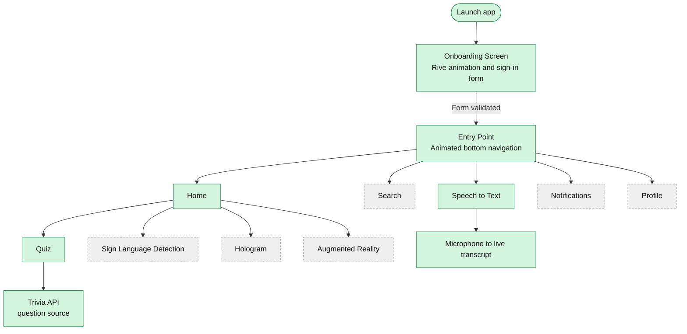
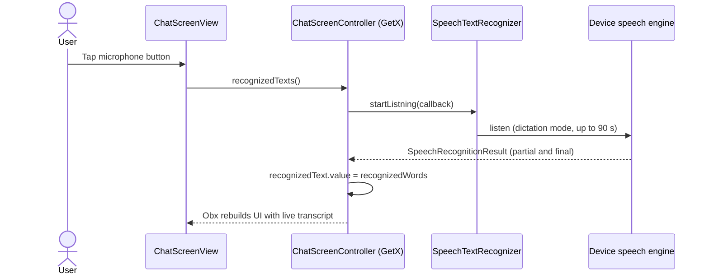
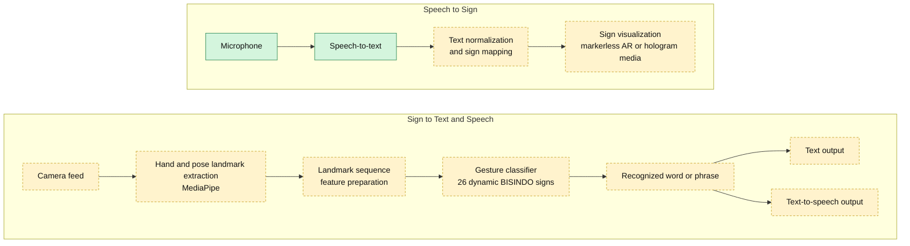

<div align="center">

# DEAFSAPP

**An accessible, Flutter-based learning companion for Indonesian Sign Language (BISINDO)**


English | [Bahasa Indonesia](README.id.md)

</div>

---

## Table of Contents

1. [Overview](#overview)
2. [Background and Impact](#background-and-impact)
3. [Scope of This Repository](#scope-of-this-repository)
4. [Features](#features)
5. [Architecture](#architecture)
6. [Tech Stack](#tech-stack)
7. [Project Structure](#project-structure)
8. [Getting Started](#getting-started)
9. [Roadmap](#roadmap)
10. [Known Limitations](#known-limitations)
11. [Acknowledgements](#acknowledgements)
12. [Author](#author)

---

## Overview

DEAFSAPP is a mobile application designed to lower the communication barrier between Deaf and hearing communities in Indonesia. It targets **BISINDO** (Bahasa Isyarat Indonesia), the sign language most widely used by Indonesia's Deaf community, and combines three ideas in a single app:

- **Learning**: interactive lessons and quizzes for students and teachers.
- **Recognition**: translating sign gestures into text and speech.
- **Visualization**: showing signs through Augmented Reality (AR) and hologram-style media.

This repository (**DEAFSAPP-V1**) contains the first version of the application: the Flutter app shell, navigation, onboarding, the speech-to-text module, and the quiz module.

---

## Background and Impact

DEAFSAPP started as a final-year Information Systems thesis project at **Universitas Muhammadiyah Sumatera Utara (UMSU)** and was developed together with **SLB Melati Aisyah** (a special-needs school in Medan) as a community-service initiative.

Results reported for the thesis-stage system:

| Metric | Result |
|---|---|
| Dynamic BISINDO sign sequences recognized | **26** |
| Gesture recognition accuracy | **76.1%** |
| Positive usability score | **76.5%** |
| Field-test participants | **17 students and 8 teachers** |
| Recognition | National Finalist, Student Digital Innovation Competition (LIDM) 2023 |
| Recognition | Fully funded thesis research program at Universitas Pendidikan Indonesia (UPI), Bandung |
| Intellectual property | Registered Indonesian copyright (Hak Cipta), Reg. No. EC00202341333, DJKI, 2023 |

> These results describe the thesis-stage system as a whole. The machine learning models and the full AR pipeline behind them are **not part of this repository snapshot**. See [Scope of This Repository](#scope-of-this-repository).

---

## Scope of This Repository

To keep expectations clear, here is exactly what this repository does and does not contain.

| Area | Status in this repo |
|---|---|
| App shell, routing, dependency injection (GetX) | Implemented |
| Animated onboarding and sign-in form (Rive) | Implemented (UI only, no backend authentication) |
| Animated bottom navigation (Rive) | Implemented |
| Speech-to-Text screen (live transcript from microphone) | Implemented |
| Quiz module (timer, scoring, answer feedback) | Implemented (uses a public trivia API as placeholder content) |
| Sign language detection screen | Placeholder |
| Augmented Reality screen | Placeholder |
| Hologram screen | Placeholder |
| Search and Profile screens | Not yet implemented |
| Gesture-recognition model (MediaPipe landmarks and classifier) | Not included |

---

## Features

**Available now**

- Onboarding flow with animated sign-in form, loading, success, and confetti feedback.
- Home screen with menu cards (Quiz, Sign Language Detection, Hologram, Augmented Reality).
- Floating, animated bottom navigation with five tabs.
- Speech-to-Text: tap the microphone and speech is transcribed live on screen, useful as a "hearing person to Deaf person" communication aid.
- Quiz: 60-second timer per question, shuffled answer options, green and red answer feedback, and a points counter.

**In development**

- Real-time BISINDO gesture recognition from the camera.
- Markerless AR visualization of signs.
- Text-to-speech output for recognized signs.
- BISINDO-specific quiz content for classroom use.

---

## Architecture

### 1. Application flow (as implemented in this repo)



Green nodes are implemented. Dashed grey nodes are placeholders.

### 2. Speech-to-Text sequence



### 3. Target system pipeline (design reference)

The diagram below describes the intended end-to-end design of DEAFSAPP: two-way translation between sign language and speech. The recognition and AR stages are **planned or thesis-stage components and are not included in this snapshot**.



Green: implemented in this repo (microphone and speech-to-text). Yellow dashed: planned or thesis-stage.

---

## Tech Stack

| Layer | Technology | Purpose |
|---|---|---|
| Framework | Flutter, Dart | Cross-platform UI |
| State, routing, DI | [GetX](https://pub.dev/packages/get) | Controllers, bindings, named routes |
| Animation | [Rive](https://pub.dev/packages/rive) | Onboarding, navigation icons, loading and confetti |
| Graphics | [flutter_svg](https://pub.dev/packages/flutter_svg) | Vector icons and shapes |
| Speech input | [speech_to_text](https://pub.dev/packages/speech_to_text) | Live transcription |
| Content | Open Trivia DB (HTTP) | Placeholder quiz questions |

Declared in `pubspec.yaml` for upcoming features and not yet used in this snapshot: `flutter_tts`, `video_player`, `permission_handler`, `avatar_glow`, `highlight_text`.

---

## Project Structure

The app follows a GetX modular layout: every feature has its own `bindings`, `controllers`, and `views`.

```text
lib/
├── main.dart                      # App entry, controller registration, routes
├── entry_point.dart               # Bottom navigation host (5 tabs)
└── app/
    ├── routes/                    # Route names and page registry
    ├── data/
    │   ├── components/            # Reusable widgets (animated bar)
    │   ├── models/                # Course, Rive asset models
    │   ├── utils/                 # Rive helpers
    │   └── constants.dart
    └── modules/
        ├── OnboardingScreen/      # Animated onboarding and sign-in form
        ├── home/                  # Menu cards, quiz, AR / hologram / detection screens
        ├── ChatScreen/            # Speech-to-Text feature
        ├── Search/                # Placeholder
        ├── BellScreen/            # Placeholder
        └── Profile/               # Placeholder
assets/                            # Rive files, icons, avatars, fonts, quiz artwork
android/ ios/ web/ linux/ macos/ windows/   # Platform runners
```

---

## Getting Started

### Prerequisites

- A recent stable [Flutter SDK](https://docs.flutter.dev/get-started/install). The dependency lockfile resolves against Flutter 3.22 or newer.
- Android Studio or VS Code with the Flutter extension.
- An Android or iOS device or emulator. A real device is recommended for speech recognition.

### Installation

```bash
git clone https://github.com/dkiplikurniawan/DEAFSAPP-V1.git
cd DEAFSAPP-V1
flutter pub get
flutter run
```

### Microphone permission

The Speech-to-Text screen needs microphone access.

- **Android:** add `<uses-permission android:name="android.permission.RECORD_AUDIO"/>` to `android/app/src/main/AndroidManifest.xml`.
- **iOS:** add `NSMicrophoneUsageDescription` and `NSSpeechRecognitionUsageDescription` to `ios/Runner/Info.plist`.

### Using the app

1. Open the app and complete the onboarding form.
2. On **Home**, choose a menu card such as **Mari Latihan Quis** to start the quiz.
3. Open the **Speech to Text** tab, tap the microphone, and speak. The transcript appears live.

---

## Roadmap

- [x] App shell with GetX routing and modular structure
- [x] Animated onboarding and bottom navigation
- [x] Speech-to-Text module
- [x] Quiz module with timer and scoring
- [ ] Real-time BISINDO gesture recognition (camera, landmarks, classifier)
- [ ] Markerless AR sign visualization
- [ ] Text-to-speech for recognized signs
- [ ] BISINDO-specific quiz and lesson content
- [ ] Search, Profile, and Notifications screens
- [ ] Real authentication and user progress tracking
- [ ] Automated tests and CI

---

## Known Limitations

- The sign-in form is a UI flow only. There is no backend authentication.
- Quiz questions come from a general trivia API in English, not from BISINDO material.
- The sign detection, hologram, and AR screens are placeholders.
- The Search and Profile screens are stubs and should be implemented before use.
- Microphone permissions must be added to the platform manifests (see above).

---

## Acknowledgements

- **SLB Melati Aisyah**, Medan: school partner and field-test community.
- **Universitas Muhammadiyah Sumatera Utara (UMSU)**: academic home of the thesis.
- **Universitas Pendidikan Indonesia (UPI)** and the **Ministry of Education, Culture, Research, and Technology**: LIDM 2023 national finalist program.
- Parts of the onboarding and quiz UI follow publicly available Flutter tutorial templates (Rive animated onboarding and a trivia quiz).

---

## Author

**Dul Kipli Kurniawan**
Information Systems graduate, UI/UX and Flutter developer, AI application developer.
Medan, North Sumatra, Indonesia.

GitHub: [@dkiplikurniawan](https://github.com/dkiplikurniawan)

<!-- Add demo video link and screenshots here -->
